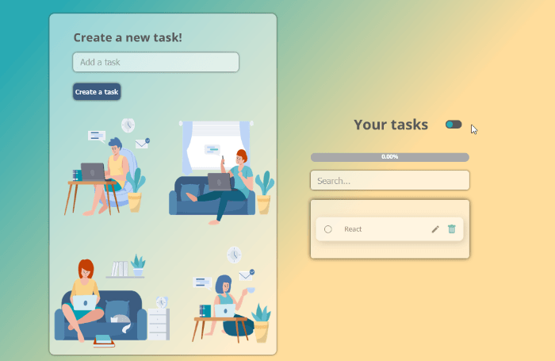

# **ToDo's app**

- [**ToDo's app**](#todos-app)
  - [About the project](#about-the-project)
  - [Tech stack](#tech-stack)
  - [Getting started](#getting-started)
    - [Prerequisites](#prerequisites)
    - [Testing locally](#testing-locally)
  - [Test it out](#test-it-out)

## About the project

---

This project was developed during this courses:

- [**React introduction**](https://platzi.com/cursos/react/)
- [**React render and compositing patterns**](https://platzi.com/cursos/react-patrones-render/)

I have made these improvements on top of the Platzi courses' contents

- Toast notifications
- Desktop layout
- Small mobile layout
- Dark mode
- Uncheck tasks
- Update task's text
- Input validation
- Progress bar

## Tech stack

---

<!-- markdownlint-disable MD033 -->
<p>
    <a href="https://developer.mozilla.org/en-US/docs/Glossary/HTML5" >
        
    </a>
    <a href="https://developer.mozilla.org/en-US/docs/Web/CSS" >
        
    </a>
    <a href="https://developer.mozilla.org/en-US/docs/Web/javascript" >
      
    </a>
    <a href="https://reactjs.org/" >
        
    </a>
</p>
<!-- markdownlint-enable MD033 -->

## Getting started

---

### Prerequisites

|               | Version       | Installation |
| ------------- | ------------- | ------------- |
| npm           | 8.19.2+       | `npm install npm@latest -g`  |

### Testing locally

```bash
git clone git@github.com:YuneidyC/todo-app.git # Clone the repo
npm install # Install NPM packages
npm run start # Run the app
```

## Test it out

---

You can test this here.

- Adding task

    

- Updating task

    

- Removing task

    

- Completing tasks

    

- Search

    

- Dark mode

    

- Tablet / big mobile

    

- Small mobile

    

- Local listener

    
